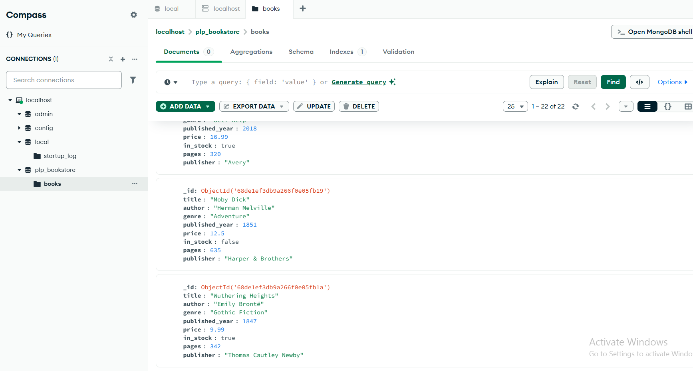

# 📚 PLP Bookstore - MongoDB Data Layer Implementation

This project demonstrates MongoDB fundamentals through a comprehensive bookstore database application. It includes a diverse dataset of books and showcases various MongoDB operations including CRUD, queries, aggregations, and indexing.

## 📋 Project Overview


*Screenshot of the books collection in MongoDB Compass*

## 🛠️ Features

- **Diverse Book Collection**: 22 books across multiple genres
- **Comprehensive Queries**: Examples of common MongoDB operations
- **Performance Optimization**: Includes indexing examples
- **Modern Development**: Built with Node.js and MongoDB

## 📊 Dataset Details

The database contains a rich collection of books with the following characteristics:

### Genres Included:
- Fiction
- Dystopian
- Science Fiction
- Historical Fiction
- Fantasy
- Thriller
- Self-Help
- History
- Young Adult
- Romance
- Political Satire
- Mystery
- Memoir
- Gothic Fiction

### Book Information:
- Title and Author
- Publication Year (1813 - 2021)
- Price (ranging from $7.99 to $24.99)
- Page Count (112 - 1178 pages)
- Publisher Information
- Stock Availability

## 🚀 Getting Started

### Prerequisites

- Node.js (v18 or higher)
- MongoDB Community Edition (local installation or Atlas account)
- MongoDB Shell (mongosh) or MongoDB Compass

### Installation

1. Clone the repository:
   ```bash
   git clone <repository-url>
   cd mongodb-data-layer-fundamentals-and-advanced-techniques-Haftom2323
   ```

2. Install dependencies:
   ```bash
   npm install
   ```

3. Start MongoDB service (if running locally)

### Populating the Database

Run the following command to populate your MongoDB database:

```bash
node insert_books.js
```

This will:
- Connect to your local MongoDB instance
- Create a database named `plp_bookstore`
- Create a collection named `books`
- Insert 22 book documents with diverse attributes

## 🧪 Running Queries

To execute the example queries demonstrating MongoDB operations:

```bash
node queries.js
```

This script demonstrates:
- Basic CRUD operations
- Advanced queries with filtering and projection
- Aggregation pipelines
- Indexing and performance analysis

## 📂 Project Structure

- `insert_books.js`: Script to populate the database with book data
- `queries.js`: Contains example MongoDB queries and operations
- `Week1-Assignment.md`: Original assignment instructions
- `collection.png`: Screenshot of the MongoDB collection

## 📚 Learning Resources

- [MongoDB Documentation](https://docs.mongodb.com/)
- [MongoDB University](https://university.mongodb.com/)
- [MongoDB Node.js Driver](https://mongodb.github.io/node-mongodb-native/)
- [MongoDB Aggregation Framework](https://www.mongodb.com/docs/manual/aggregation/)

## 📝 Notes

- The database connection is configured for local MongoDB by default
- Update the connection string in `insert_books.js` and `queries.js` if using MongoDB Atlas
- The `queries.js` file includes detailed comments explaining each operation